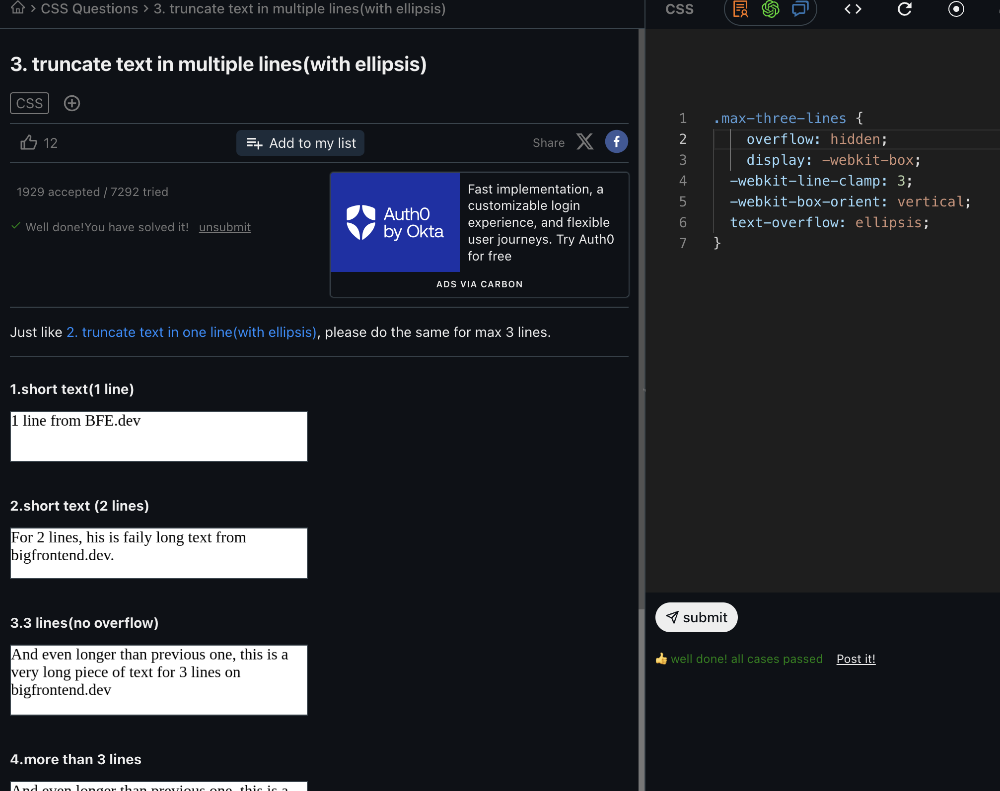

https://bigfrontend.dev/css/center-an-element-vertically/solution

## approach 2 

.autobot {
  display: flex;
}
.autobot > * {
  margin: auto;
}

> * means all direct children under autobot 

## approach 3 

.content-center {
  display: grid;
  place-content: center;
  gap: 1ch;
}

# BEst 

source: https://web.dev/articles/centering-in-css#5_pop_plop

https://css-tricks.com/line-clampin/

