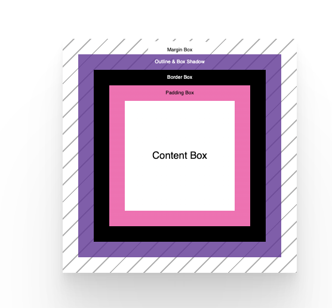

everything in css is a box

intrinsic sizing vs extrinsic 

extrinsic - specify the width / height 

intrinsic 
        - default 
        - dont specify any size 
        - width : min-content

box model - 

content box 

padding box : If our box has overflow rules set, such as overflow: auto or overflow: scroll, the scrollbars will occupy this space too.

border box ; 

margin box: Properties such as outline and box-shadow occupy this space too because they are painted on top, so they don't affect the size of our box

user agent stylesheet  - Every browser applies a user agent stylesheet to HTML documents. They define how elements should look and behave if there's no CSS defined.

some defaults :  

  default display value is block
  a <li> has a default display value of list-item
   and a  has a default display value of inline.

block
inline
inline-block

An inline element has block margin, but other elements won't respect it.
Use inline-block, and those elements will respect the block margin
 
A block item will, by default, fill the available inline space, whereas a inline and inline-block elements will only be as large as their content.

box-sizing, which tells our box how to calculate its box size. 

By default, all elements 
         box-sizing: content-box; ----   such as a width and height, they will be applied to the content box. 

