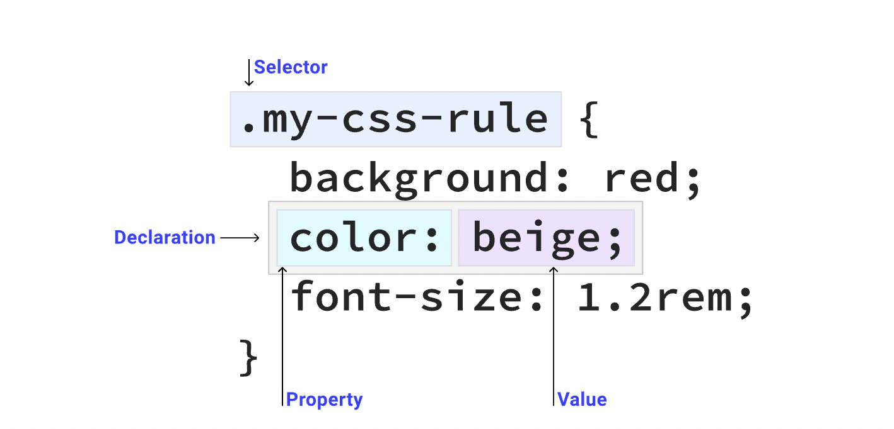

types of slectors: 

css rule : 

psuedo classes 

https://web.dev/learn/css/pseudo-classes

psuedo elemnts

combination 

descendant ( )

next sibling (+)

Subsequent- sibling combinator (~)

compound selector 

-a.mark
-all a elements to have .mark class

