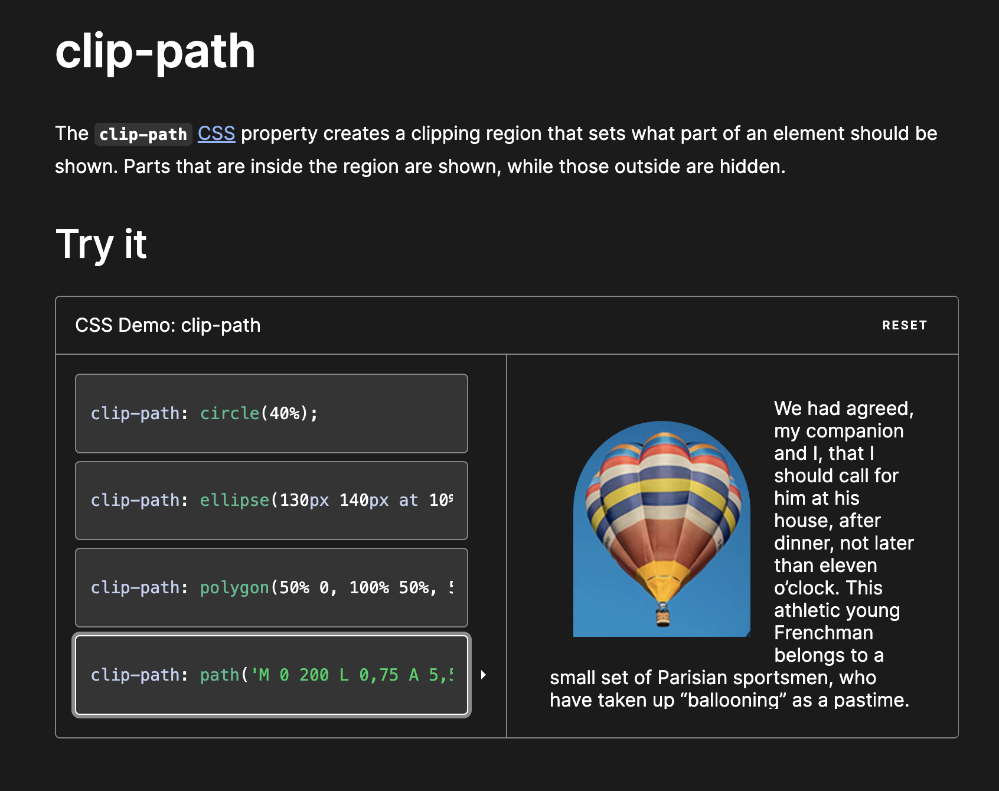

what is function 

css - ot of inbuilt functions , use provided , cant write new ones
css - most functions - pure functions - same input , same output 

functional selectors - psuedoselectors - :is() , :not()

custom pops -to tokenise - doube dash (--) and case sensitive 

var - retrieve val of cust prop

var(--custom-property , fallback )

:root{
--custom-property : #osjd;
}

attr()

content: attr(href)

url() - url of photos , content , fonts
        - 

Math functions

        calc() -math expression , with any units , any angle , freq , len, num  eg usage: sizing
        min()
        max()
        clamp()

color functions : rgb(), rgba(), hsl(), hsla(), hwb(), lab() and lch().
grid functions:
functional selectors

Shapes -  circle , ellipse , inset ,polygon

        clip-path
        

offset-path
The offset-path CSS property specifies a path for an element to follow and determines the element's positioning within the path's parent containe

shape-outside
The shape-outside CSS property defines a shape—which may be non-rectangular—around which adjacent inline content should wrap. 

       

        clip-path : polygon(X y , x Y)

Transforms
        transform : rotate()
        rotate - central axis
        rotateX , roatateY , rotateZ , rotate3d

        transform : scale()
        scale
        scaleX , Y , Z , 3d 

        transform : translate()
        translate
        translateX , Y , Z , 3d 

        transform : skew()
        skew
        skewX , Y , Z , 3d 

perscpective -

