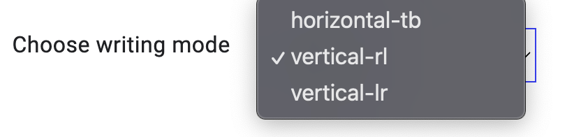

Rows and columns
To create a basic grid you can define a grid with 

three column tracks, 
two row tracks and 
a 10 pixel gap between the tracks as follows.

.container {
    display: grid;
    grid-template-columns: 5em 100px 30%;
    grid-template-rows: 200px auto;
    gap: 10px;
}

Intrinsic sizing :

 when auto is used the grid columns stretch to fill the container. Auto sized tracks will stretch by default if there is additional space in the grid container.

min-content
max-content
fit-content()

The min-content keyword 

-will make a track as small as it can be without the track content overflowing.
-Changing the example grid layout to have three column tracks all at min-content size will mean they become as narrow as the longest word in the track.

The max-content keyword 
-has the opposite effect. 

-The track will become as wide enough for all of the content to display in one long unbroken string. 
-This might cause overflows as the string will not wrap.

The fit-content(size) function 
-acts like max-content at first. 
-once the track reaches the size that you pass into the function, the content starts to wrap
-So fit-content(10em) will create a track that is less than 10em, if the max-content size is less than 10em, but never larger than 10em.

The fr unit 

-just like % , em , rem , there is fr - it works only in grid
-similar to flex:auto
-can be combined with a fixed size gap or fixed size tracks ex: grid-template-columns: 200px 1fr.

The minmax() function #

-This function means that you can set a minimum and a maximum size for a track

-To force a track to take an equal share of the space in the grid container minus gaps use minmax. 
-Replace 1fr as a track size with minmax(0, 1fr).
-This makes the minimum size of the track 0 and not the min-content size
-Grid will then take all of the available size in the container, deduct the size needed for any gaps, and share the rest out according to your fr units.

 create a 4 column track grid with equal columns,

grid-template-columns: minmax(0,1fr), minmax(0,1fr),  minmax(0,1fr), minmax(0,1fr) ; 

                    or use 

grid-template-columns: repeat(12, minmax(0,1fr));

other ex: can be used to repeat any section of your track listing

    grid-template-columns: 200px repeat(2, 1fr 2fr) 200px; /*creates 6 tracks*/

Auto fit vs Auto fill

 create as many 200 pixel tracks as will fit in the container.

 Auto Responsive Grid : 
        there will be as many tracks as will fit into the container with a minimum size of 200px.

        grid-template-columns: repeat(auto-fill, minmax(200px,1fr));

        Grid then lays out the 200 pixel tracks and whatever space is leftover is distributed equally to them.

        This creates a two-dimensional responsive layout with no need for any media queries

     

Auto placement : 

Items are placed on the grid one per cell in the order that they appear in the source. 
For many layouts this might be all you need. If you need more control then

The default behavior of grid layout is to place items along the rows.
to place into columns using grid-auto-flow: column

grid-auto-flow and the writing-mode property.

Spanning tracks
You can cause some or all of the items in an auto-placed layout to span more than one track. Use the span keyword plus the number of lines to span as a value for grid-column-end or grid-row-end.

.item {
    grid-column-end: span 2; /* will span two lines, therefore covering two tracks */
}
As you have not specified a grid-column-start, this uses the initial value of auto and is placed according to the auto-placement rules. 

the shorthand grid-column:

.item {
    grid-column: auto / span 2;
}

Filling gaps

An auto-placed layout with some items spanning multiple tracks may result in a grid with some unfilled cells. 

The default behavior of grid layout with a fully auto-placed layout is to always progress forward. The items will be placed according to the order they are in the source, or any modification with the order property. If there is not enough space to fit an item, grid will leave a gap and move to the next track.

in dense packing mode. (grid-auto-flow : dense.)

grid will take items later in the layout and use them to fill gaps. This may mean that the display becomes disconnected from the logical order.

Placing items
<h3>
    
    CSS Grid Layout is based on a grid of numbered lines.
     The simplest way to place things onto the grid is to place them from one line to another
</h3>

The properties that you can use to place items by line number are:

grid-column-start
grid-column-end
grid-row-start
grid-row-end
They have shorthands which allow you to set both start and end lines at once:

grid-column
grid-row

Implicit Grid - auto 
Explicit Grid - rows and columns that u define  

To create all implicit rows at a minimum size of 10em and a maximum size of auto:

grid-auto-rows: minmax(10em, auto);

Named grid lines
It can make it easier to place items into a layout if the lines have a name rather than a number. 

.container {
    display: grid;
    grid-template-columns:
      [main-start aside-start] 1fr
      [aside-end content-start] 2fr
      [content-end main-end]; /* a two column layout */
}

.sidebar {
    grid-column: aside-start / aside-end;
    /* placed between line 1 and 2*/
}

footer {
    grid-column: main-start / main-end;
    /* right across the layout from line 1 to line 3*/
}

Grid Template Areas
You can also name areas of the grid and place items onto those named areas. 

To start, give the direct children of your grid container a name using the grid-area property:

header {
    grid-area: header;
}

.sidebar {
    grid-area: sidebar;
}

.content {
    grid-area: content;
}

footer {
    grid-area: footer;
}

use the grid-template-areas property to define which grid cells each item will span. Each row is defined within quotes.

.container {
    display: grid;
    grid-template-columns: repeat(4,1fr);
    grid-template-areas:
        "header header header header"
        "sidebar content content content"
        "sidebar footer footer footer";
}
There are a few rules when using grid-template-areas.

The value must be a complete grid with no empty cells.
To span tracks repeat the name.
The areas created by repeating the name must be rectangular and cannot be disconnected.
If you break any of the above rules the value is treated as invalid and thrown away.

To leave white space on the grid use a . or multiples with no white space between them. For example to leave the very first cell on the grid empty I could add a series of . characters:

.container {
    display: grid;
    grid-template-columns: repeat(4,1fr);
    grid-template-areas:
        "....... header header header"
        "sidebar content content content"
        "sidebar footer footer footer";
}

