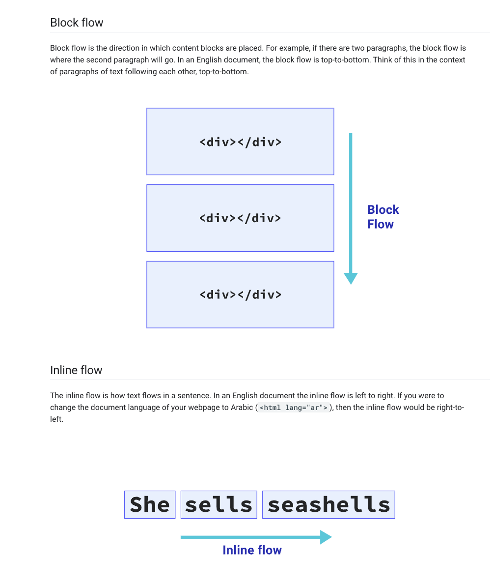
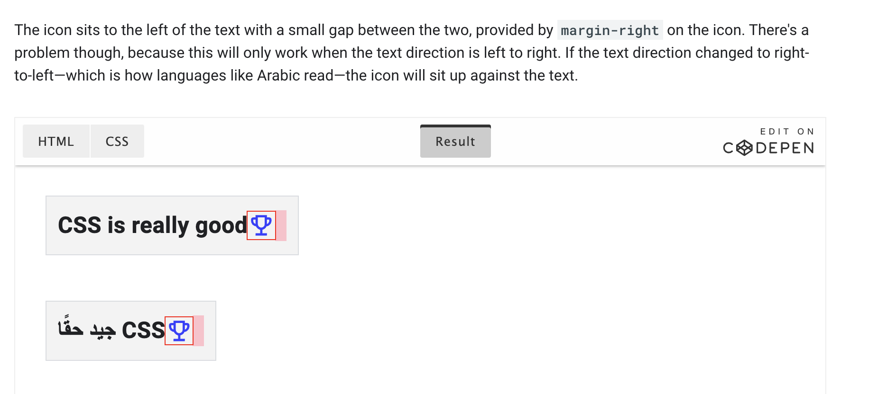
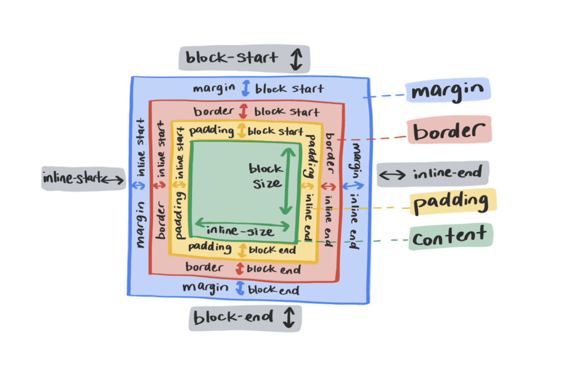
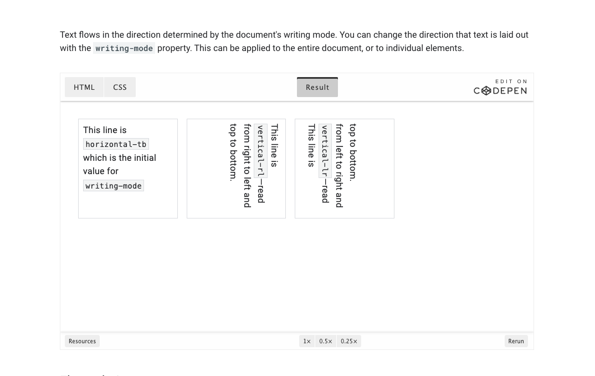
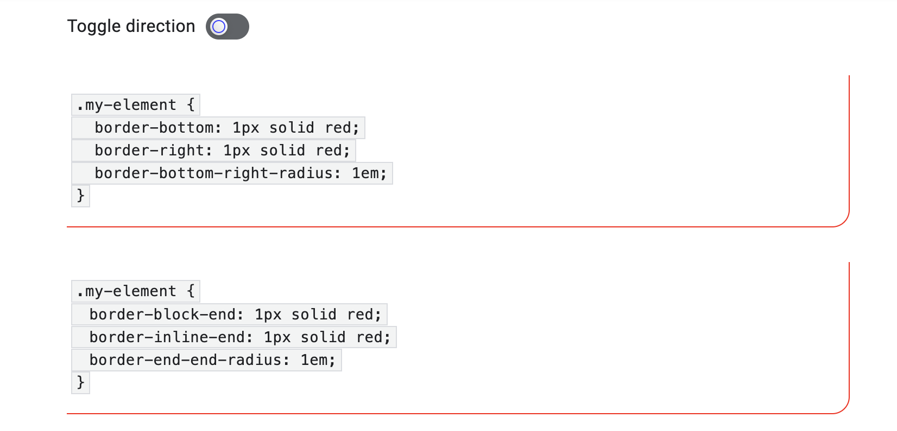

Logical properties, on the other hand, refer to the edges of a box as they relate to the flow of content. Therefore, they can change if the text direction or writing mode changes. 

writing mode: 

  max-width: 150px;
  max-height: 100px;

instead of this use : 

 max-inline-size: 150px;
  max-block-size: 100px;

 
  use text-align: end;  instead of  text-align: right;

 padding-block: 2em;                            padding 
  margin-inline: 2em 0;      instead of         margin  
  position: relative;           
  inset-block: 0.2em 0;                         top 

   
   

   Logical properties bring two new units: vi and vb. 
   A vi unit is 1% of the viewport size in the inline direction. The non-logical property equivalent is vw. 
   
   The vb unit is 1% of the viewport in the block direction. The non-logical property equivalent is vh.