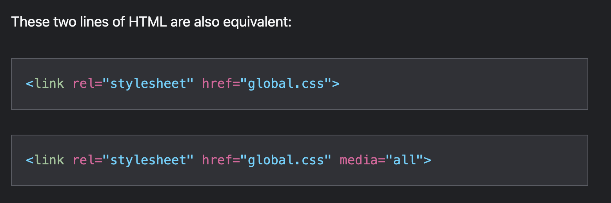

Media queries : 

1. @media keyword

2.for print 
            - @media print{}
            or 
            <link rel="stylesheet" href="print.css" media="print">

If you don't specify any media type for your CSS, it will automatically have a media type value of all

Media Queries 
The CSS is applied only if the media type matches and the condition is also true. These conditions are called media features.

Choose breakpoints based on the content

The point at which a media feature condition becomes true is called a breakpoint.
 It's best to choose your breakpoints based on your content rather than popular device sizes, as those are subject to change with every technology release cycle.

@media (min-width: 50em) and (min-height: 60em) {
  article {
    column-count: 2;
  }
}

----------------------------------------------------------------------------------------------------

Meta element for viewport #
even if you used a liquid layout, the browser would apply a width of 980 pixels and then scale the rendered web page down to the actual width of the screen.

If you're using responsive design you need to tell the browser not to do that scaling. You can do that with a meta element in the head of the web page:

<meta name="viewport" content="width=device-width, initial-scale=1">

There are two values, separated by commas. 

The first one is width=device-width. This tells the browser to assume the width of the website is the same as the width of the device (instead of assuming the width of the website is 980 pixels).

 The second value is initial-scale=1. This tells the browser how much or how little scaling to do. With a responsive design, you don't want the browser to do any scaling at all.

 