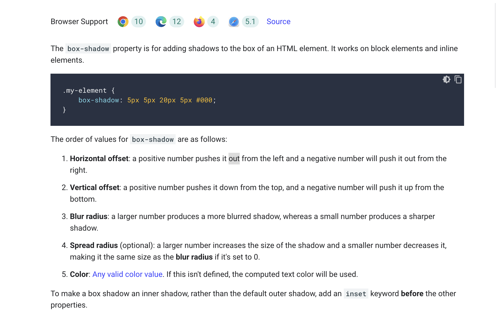
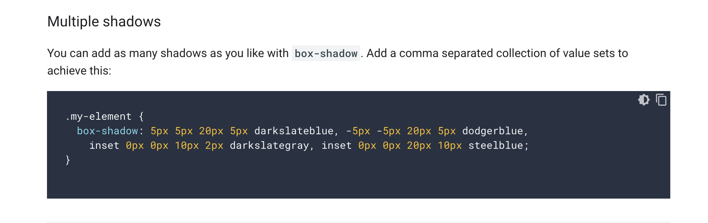
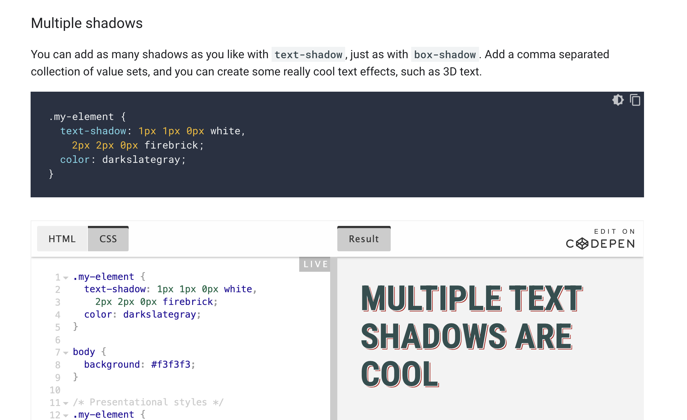
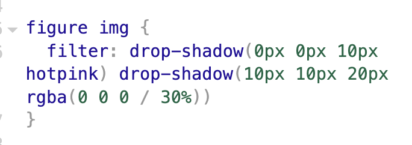
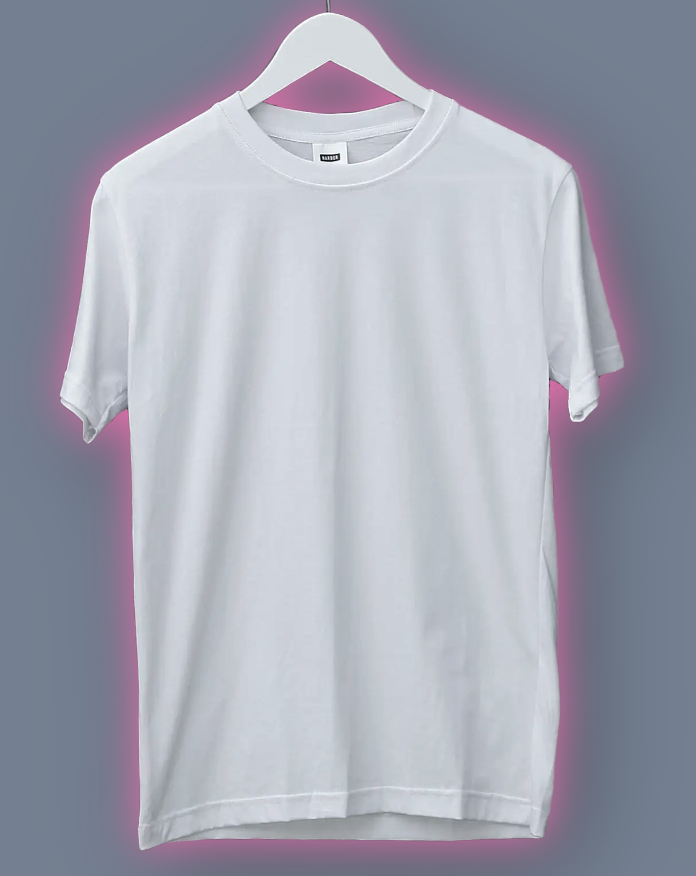

https://codepen.io/Rach715/pen/jOdreeG

Multiple shadows - comma separated collection of value sets to

If your box with box-shadow is in a container that has overflow: hidden, the shadow won't break out of that overflow either.

codepen - https://codepen.io/Rach715/pen/eYxzPoL

Text shadow

The only difference is that text-shadow has no spread value and no inset keyword.

https://codepen.io/Rach715/pen/qBgNJze

<h3>Drop shadow </h3>

To achieve a drop shadow that follows any potential curves of an image, use the CSS drop-shadow filter

drop shadow - same as b-shadow , but no inset (inner shadow) , no spread
can add as many shadows as you like - by adding multiple instances of drop-shadow values to the filter property. - Each shadow will use the last shadow as a positioning reference point.

    

            for

    
