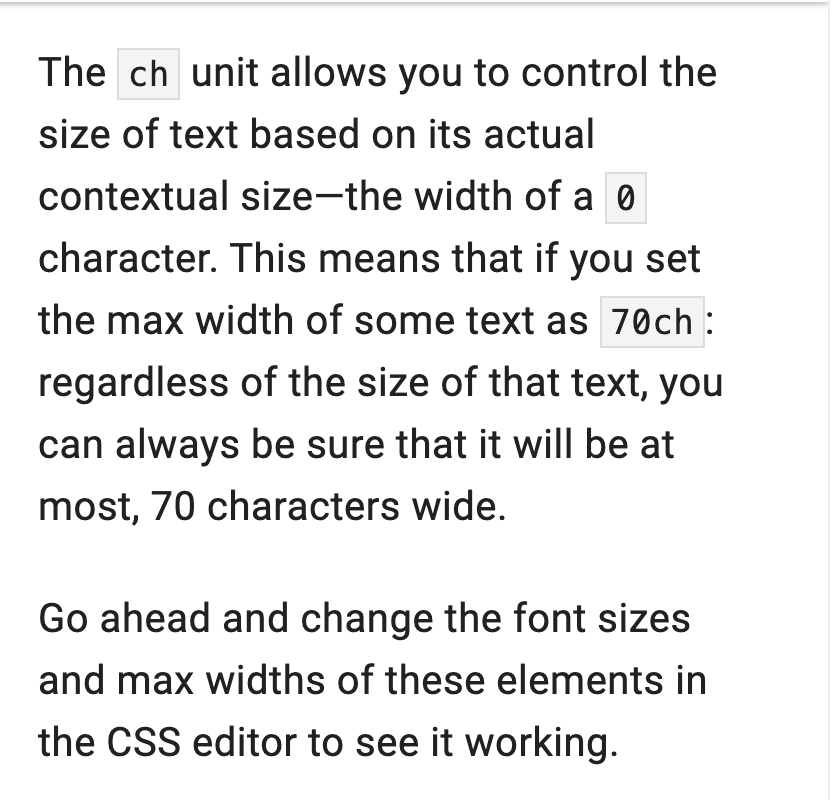
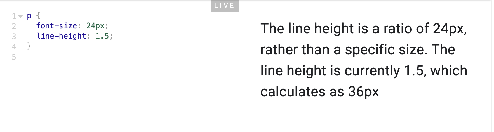

The web is a responsive medium, but sometimes you want to control its dimensions to improve the overall interface quality. A good example of this is limiting line lengths to improve readability. How would you do that in a flexible medium like the web?

Unitless line-height refers to the font-size of the element.

If your element has set font-size: 14px, do the simple math:

1.54 * 14px = 21.56px

Note: It's a good idea to use a unitless value for line-height, rather than specifying a unit. As you learned in the inheritance module, font-size can be inherited

/* <font-weight-absolute> keyword values */
font-weight: normal;
font-weight: bold;

/* <font-weight-absolute> numeric values [1,1000] */
font-weight: 100;
font-weight: 200;
font-weight: 300;
font-weight: 400; /* normal */
font-weight: 500;
font-weight: 600;
font-weight: 700; /* bold */
font-weight: 800;
font-weight: 900;

/* Keyword values relative to the parent */
font-weight: lighter;
font-weight: bolder;

Percentages
When using a percentage in CSS you need to know how the percentage is calculated.
 For example,width is calculated as a percentage of the available width in the parent element.

