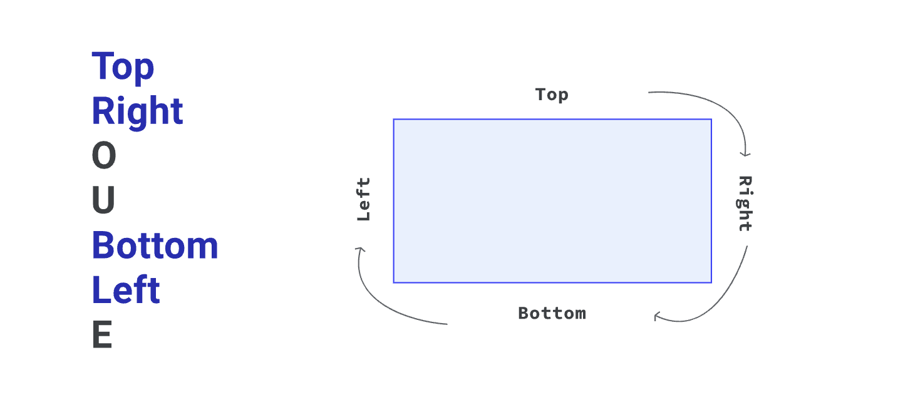
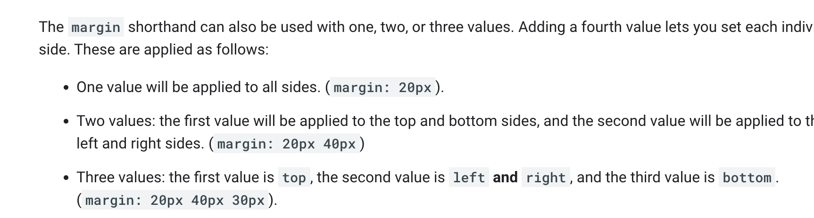
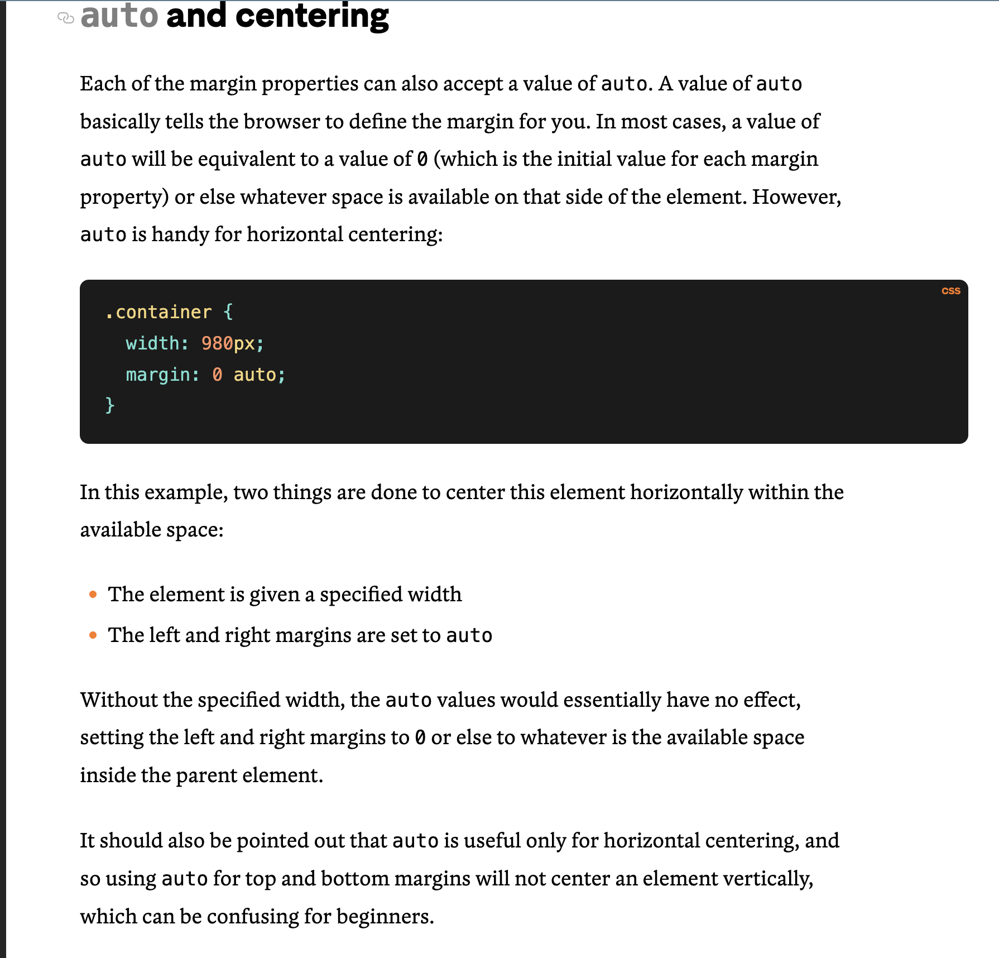

Margin 

If you use a percentage, the value will be calculated based on the width of your element's containing block.

MArgin : auto

 a value of auto will be equivalent to a value of 0 (which is the initial value for each margin property) or else whatever space is available on that side of the element.

 

 Margin collapse works by selecting the largest value of two adjoining elements with vertical margin set on the adjoining sides.

 Only block margins collapse, not inline (horizontal) margins.

 If you make an element absolutely positioned, using position: absolute, the margin will no longer collapse. The margin also won't collapse if you use the float property, too.

 COnsitent Spacing

 

min-height: 100vh

 100vh means that the initial body height will take 100% of the viewport height, whereas the use of min-height instead of height will let the body element grow even more if necessary.

####TO BE READ - https://dev.to/fenok/stretching-body-to-full-viewport-height-the-missing-way-2ghd

Another way of stretching the body element to the full viewport height without the above-mentioned issues. 

The core idea is to use flexbox, which enables a child element to stretch even to a parent with non-fixed dimensions while retaining the ability to grow further.

First, we apply min-height: 100% to the html element to stretch it to the full minimal viewport height. Then we use display: flex and flex-direction: column to turn it into a flex-container with a vertical main axis. Finally, we apply flex-grow: 1 to the body element, thereby stretching it to the html height.

The align-self property of the body element implicitly has the stretch value, so the body width already matches the html width.

html {
    min-height: 100%; /* Look, it's not fixed anymore! */

    display: flex;
    flex-direction: column;
}

body {
    flex-grow: 1;
}