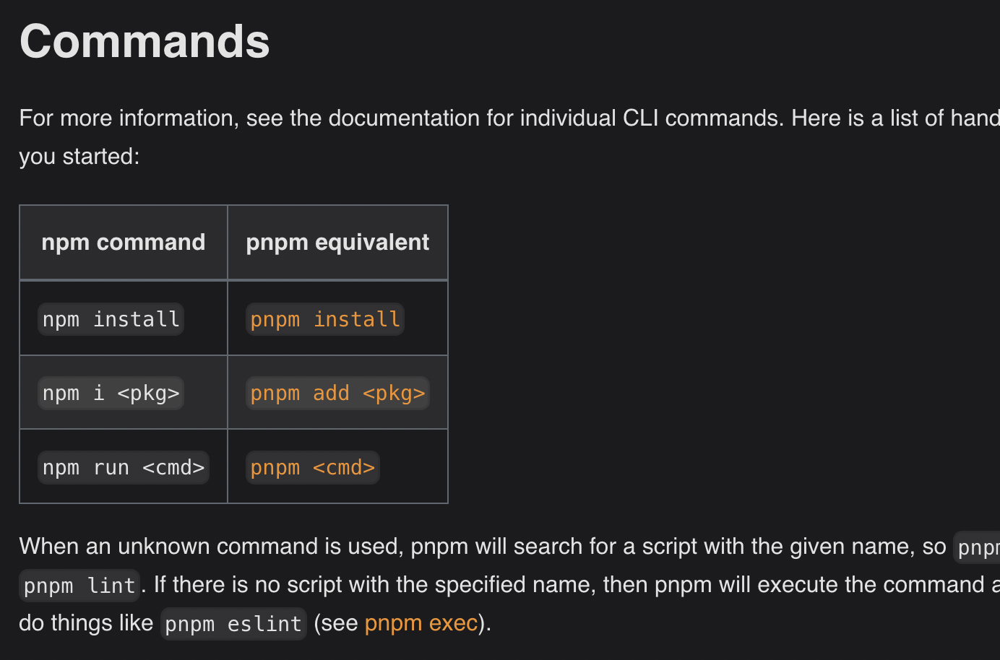

https://pnpm.io/motivation

- 100 copies of same dependies - 
- 1000s of files - disk space
- With pnpm, the dependency will be stored in a content-addressable store
All the files are saved in a single place on the disk. When packages are installed, their files are hard-linked from that single place, consuming no additional disk space. This allows you to share dependencies of the same version across projects.


Creating a non-flat node_modules directory
- symlinks - wont copy all indirect under node_modules 


- faster installation : 
pnpm perfoms installation in three stages:

Dependency resolution. All required dependencies are identified and fetched to the store.
Directory structure calculation. The node_modules directory structure is calculated based on the dependencies.
Linking dependencies. All remaining dependencies are fetched and hard linked from the store to node_modules.

- optimises update - keeps copy of only updated files 

------------------------------------------------------------


Symlinks, or symbolic links, are a type of file that act as a pointer or shortcut to another file or directory. They are used to create a link to an existing file or directory without duplicating its contents. In the context of a non-flat `node_modules` directory, symlinks can help manage dependencies more efficiently.

Here's how symlinks work in the context of `node_modules`:

### Traditional Node Modules Structure

When using npm or Yarn Classic, dependencies are hoisted to the root `node_modules` directory. This means that if multiple packages depend on the same library, that library is installed at the top level. This can lead to issues where packages have access to dependencies they didn't explicitly declare.

### Non-Flat Node Modules with Symlinks

pnpm addresses this by creating a non-flat `node_modules` directory using symlinks. Here's how it works:

1. **Direct Dependencies in Root**: Only the direct dependencies of the project are placed in the root `node_modules` directory.
2. **Nested Dependencies**: Indirect dependencies (dependencies of dependencies) are placed in their respective `node_modules` directories within the package that requires them.
3. **Symlinks**: Symlinks are created to point to the actual location of the dependency. For example, if `packageA` depends on `packageB`, and `packageB` depends on `packageC`, the structure might look like this:
   ```
   node_modules/
     packageA/
     packageB -> .pnpm/packageB@1.0.0/node_modules/packageB
     .pnpm/
       packageB@1.0.0/
         node_modules/
           packageB/
           packageC/
   ```

In this structure:
- `packageB` is a symlink in the root `node_modules` pointing to its actual location within the `.pnpm` directory.
- `packageC` is nested inside the `node_modules` of `packageB` and not directly accessible to `packageA`.

### Advantages

- **Isolation**: Each package only has access to its declared dependencies, reducing the risk of dependency conflicts.
- **Disk Space**: Reduces redundancy by reusing the same package installation across different projects.
- **Performance**: Faster installations and better disk usage management.

### Example

If you have a project with the following dependencies:

- `project` depends on `packageA`
- `packageA` depends on `packageB`

With pnpm, the `node_modules` directory might look like this:

```
project/
  node_modules/
    packageA -> .pnpm/packageA@1.0.0/node_modules/packageA
  .pnpm/
    packageA@1.0.0/
      node_modules/
        packageA/
        packageB/
```

In this case, `packageA` is a symlink pointing to its actual location within the `.pnpm` directory, and `packageB` is nested within `packageA`'s `node_modules` directory. This structure ensures that only the necessary dependencies are accessible to each package, maintaining a clean and isolated dependency tree.