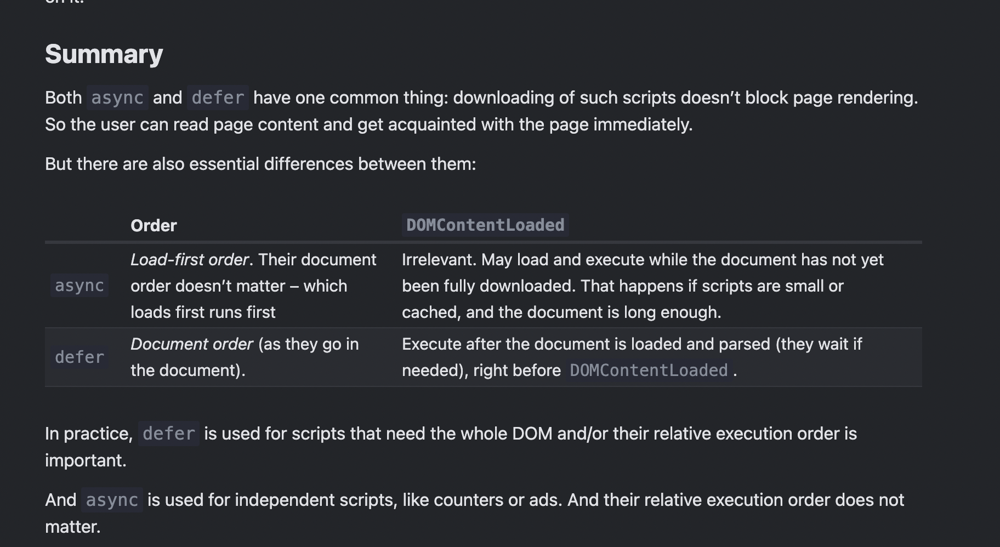
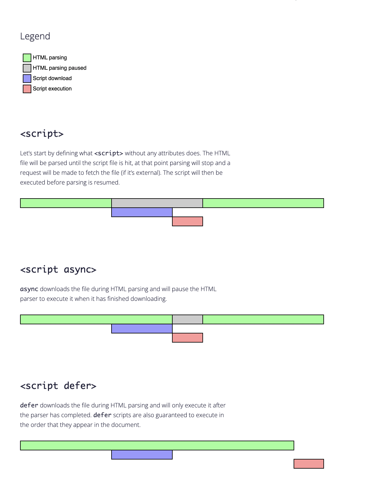
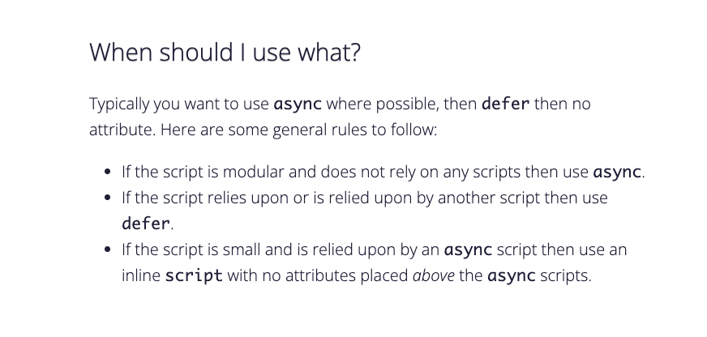

https://javascript.info/script-async-defer

why do we need these  ?

script - heavier than html , 
longer time to process 

script at beginning 
- blocks  html Content  from loading / seen by user

script at end 
- delay 
- For example, the browser notices the script (and can start downloading it) only after it downloaded the full HTML document. For long HTML documents, that may be a noticeable delay. 

there are two <script attributes that solve the problem for us: defer and async.

Defer 
- dont block DOM
- retains order of script
- executed after DOM is parsed ( DOMContentLoaded event is fired)
- best for scripts that depend on DOM
- works only for external scripts ( src tag is ignored if no src is found) 

Async -
- dont block DOM
- completely independent script 
- async scripts are executed as soon as they are downloaded
- no waiting for order of other scripts 
- independent of DOM
- best for 3rd party with relation to other scripts or DOM ( ads, counters etc)
- works only for external scripts ( async tag is ignored if no src is found) 

Dynamic 
- append scripts to dom / body dynamically
- loads as soon as appended
- no blocking of DOM
- can make script.async = false to make it bahve like defer 

Summary : 

