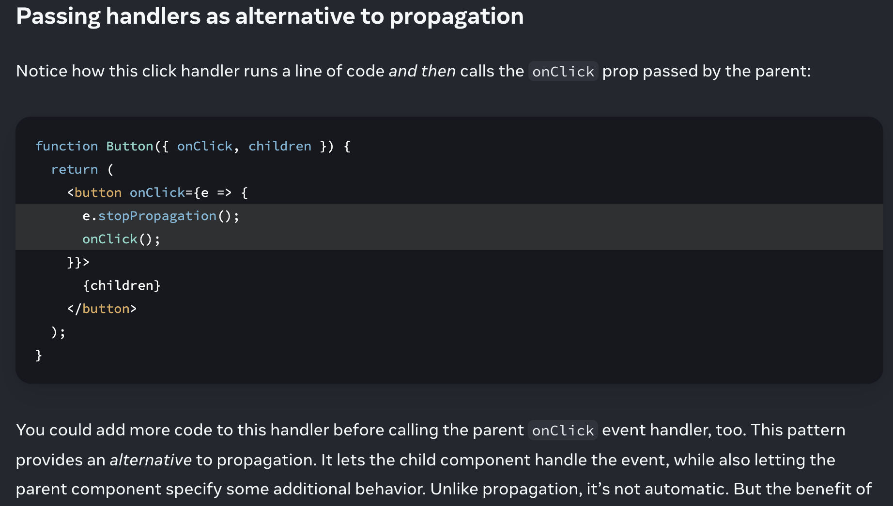

Event propagation 
Event handlers will also catch events from any children your component might have. We say that an event “bubbles” or “propagates” up the tree: it starts with where the event happened, and then goes up the tree.

Stopping propagation 
Event handlers receive an event object as their only argument. By convention, it’s usually called e, which stands for “event”. You can use this object to read information about the event.

That event object also lets you stop the propagation. If you want to prevent an event from reaching parent components, you need to call e.stopPropagation()

e.stopPropagation() stops the event handlers attached to the tags above from firing.
e.preventDefault() prevents the default browser behavior for the few events that have it.

