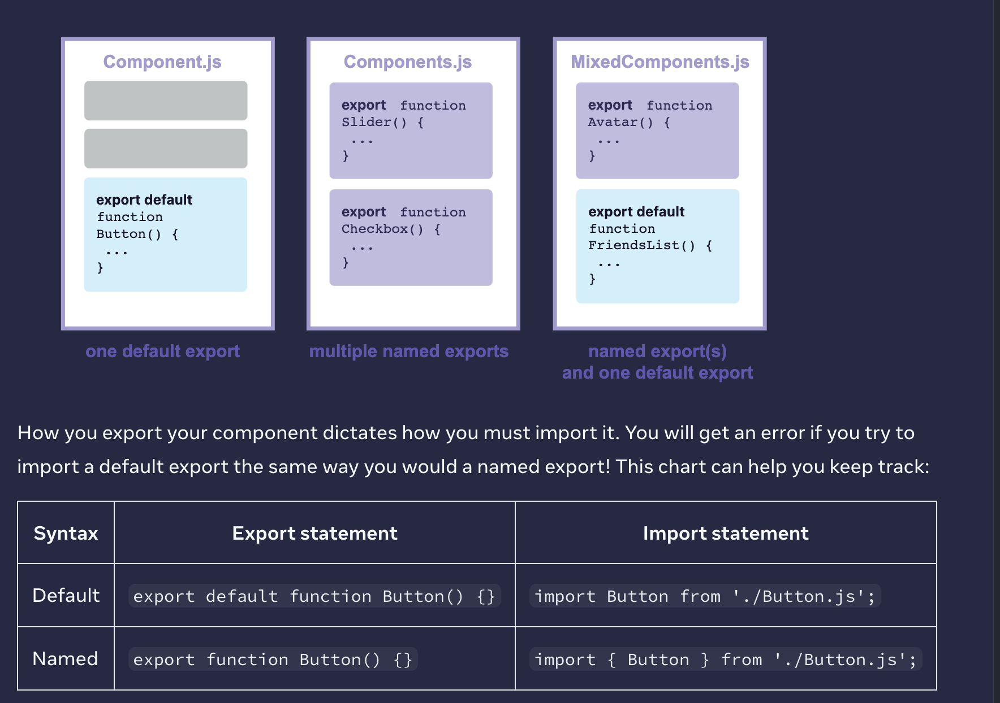

<h2>Your First Component </h2>

<h2>Imorting and Exporting </h2>

named vs default exports

:one default export, but it can have as many named exports

<h3>Writing Markup with JSX</h3>

JSX is a <b>syntax extension<b> for JavaScript that lets you write HTML-like markup inside a JavaScript file

The Web has been built on HTML, CSS, and JavaScript
But as the Web became more interactive, logic increasingly determined content. 
JavaScript was in charge of the HTML! This is why in React, rendering logic and markup live together in the same place—components

The Rules of JSX 
1. Return a single root element  - why ? but under the hood it is transformed into plain JavaScript objects. You can’t return two objects from a function without wrapping them into an array. This explains why you also can’t return two JSX tags without wrapping them into another tag or a Fragment.

2. Close all the tags 
JSX requires tags to be explicitly closed: self-closing tags , wrapping 

3. camelCase all most of the things! 

This is because JSX is stricter and has a few more rules than HTML! If you read the error messages above, they’ll guide you to fix the markup, or you can follow the guide below.

html to jsx convertor : https://transform.tools/html-to-jsx

<h2>JavaScript in JSX with Curly Braces</h2>

to add a little JavaScript logic or reference a dynamic property inside that markup. In this situation, you can use curly braces in your JSX to open a window to JavaScript.

<h3>Passing Props to a Component</h3>
React components use props to communicate with each other. Every parent component can pass some information to its child components by giving them props

Familiar props 
Props are the information that you pass to a JSX tag. For example, className, src, alt, width, and height are some of the props you can pass to an :
The props you can pass to an  tag are predefined (ReactDOM conforms to the HTML standard). 
But you can pass any props to your own components, such as <Avatar>, to customize them

destructure 
Specifying a default value for a prop 
children (jsx as props)
Forwarding props with the JSX spread syntax  - if youre not using props ifrom grandparent in  parent , pass to child without  listing each of their names.

<!-- function Profile(props) {
  return (
    

      <Avatar {...props} />
    

  );
} -->

Props are read-only snapshots in time: every render receives a new version of props.
You can’t change props. When you need interactivity, you’ll need to set state.

However, props are immutable—a term from computer science meaning “unchangeable”. When a component needs to change its props (for example, in response to a user interaction or new data), it will have to “ask” its parent component to pass it different props—a new object! Its old props will then be cast aside, and eventually the JavaScript engine will reclaim the memory taken by them.

<h3>Conditional Rendering </h3>

In React, you can conditionally render JSX using JavaScript syntax like if statements, &&, and ? : operators.