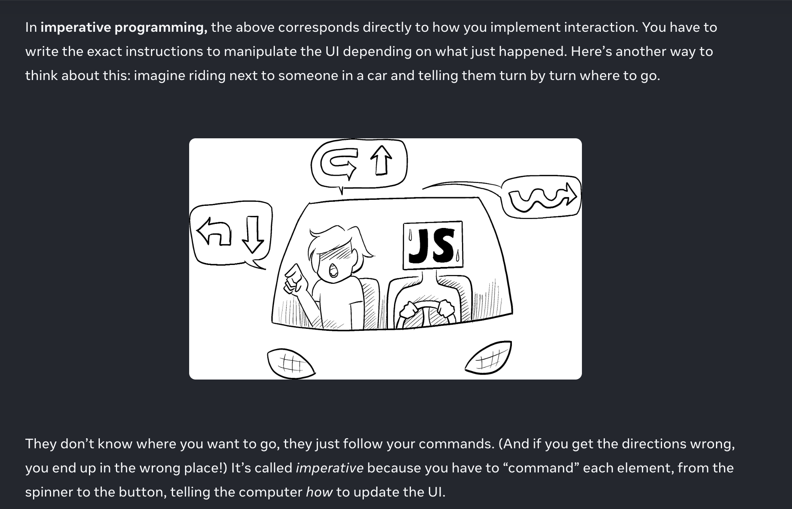
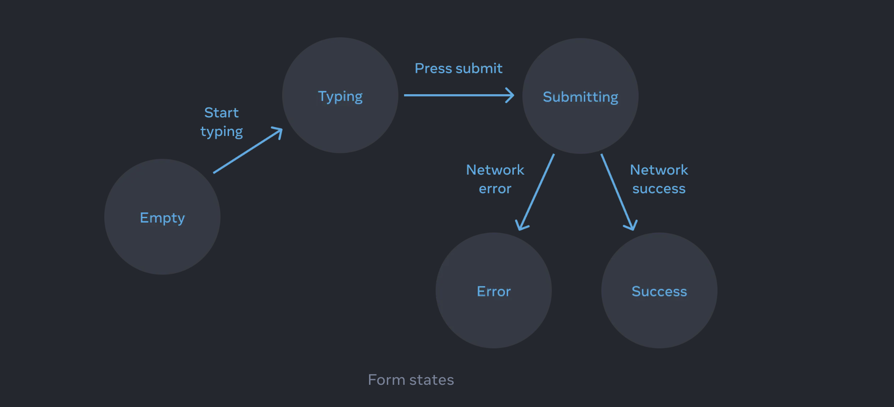
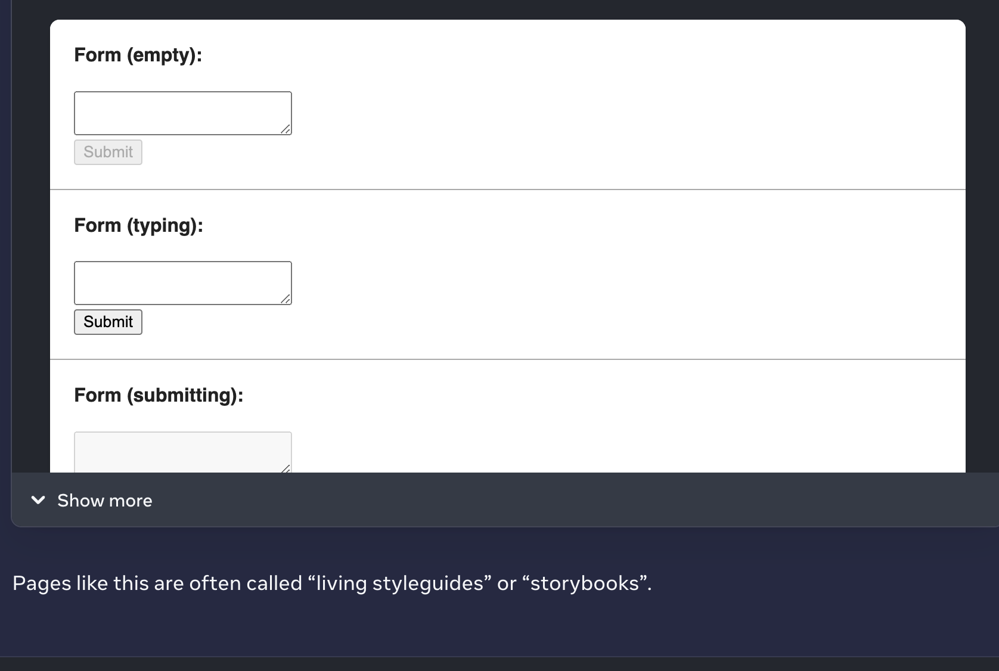

Declarative programming

Not directly modify the UI
define stages - switch between those in response to the events 

1 identify 

Reacting to Input with State
React provides a declarative way to manipulate the UI. Instead of manipulating individual pieces of the UI directly, you describe the different states that your component can be in, and switch between them in response to the user input. This is similar to how designers think about the UI.

Manipulating the UI imperatively works well enough for isolated examples, but it gets exponentially more difficult to manage in more complex systems. Imagine updating a page full of different forms like this one. Adding a new UI element or a new interaction would require carefully checking all existing code to make sure you haven’t introduced a bug (for example, forgetting to show or hide something).

React was built to solve this problem.

In React, you don’t directly manipulate the UI—meaning you don’t enable, disable, show, or hide components directly. Instead, you declare what you want to show, and React figures out how to update the UI. Think of getting into a taxi and telling the driver where you want to go instead of telling them exactly where to turn

STeps

--Identify your component’s different visual states
--Determine what triggers those state changes
--Represent the state in memory using useState
--Remove any non-essential state variables
--Connect the event handlers to set the state

-Identify your component’s different visual states

 “state machine” being in one of several “states”. 
 If you work with a designer, you may have seen mockups for different “visual states”
 

 If a component has a lot of visual states, it can be convenient to show them all on one page:

 

 When developing a component:
Identify all its visual states.
Determine the human and computer triggers for state changes.
Model the state with useState.
Remove non-essential state to avoid bugs and paradoxes.
Connect the event handlers to set state.