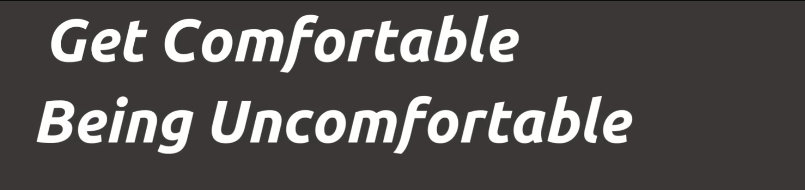
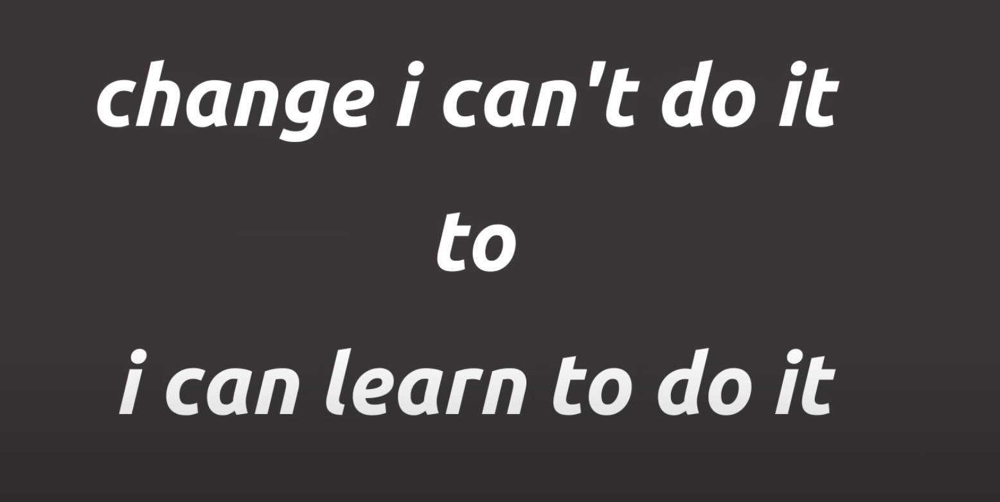
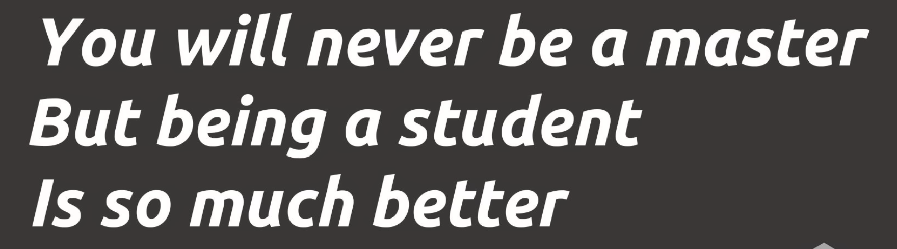
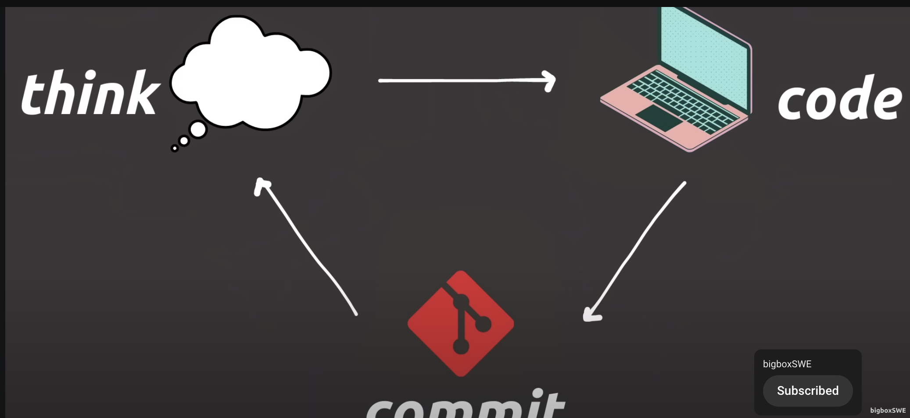
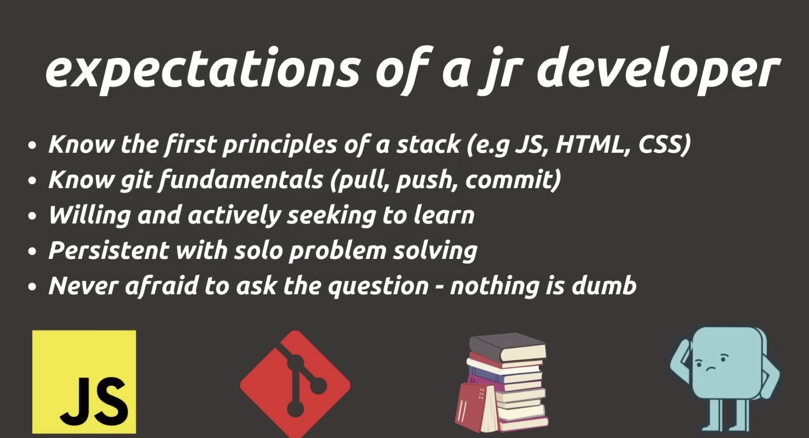

Your job is not to know everything 
u can never know everything 

However given the problem is in your domain - you are expected to go ahead and solve it 

It is gonna make u uncomfortable ,

But it just means youre growing , you are going to learn something u didnt know 
U have to learn to enjoy it 
See as part of the job
Beauty of the job 

Understand vaguely - watch h tutorials - go ahead build something - commit - iterate 

