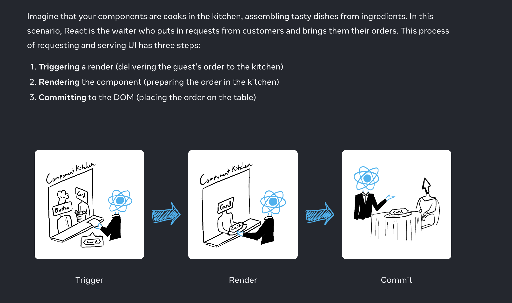

-What rendering means in React
-When and why React renders a component
-The steps involved in displaying a component on screen
-Why rendering does not always produce a DOM update

There are two reasons for a component to render:

It’s the component’s initial render.
The component’s (or one of its ancestors’) state has been updated.

it’s done by calling createRoot with the target DOM node, and then calling its render method with your component:

import Image from './Image.js';
import { createRoot } from 'react-dom/client';

const root = createRoot(document.getElementById('root'))
root.render(<Image />);

Re-renders when state updates

Updating your component’s state automatically queues a render.

Rendering” is React calling your components.

On initial render, React will call the root component.
For subsequent renders, React will call the function component whose state update triggered the render.
This process is recursive: if the updated component returns some other component, React will render that component next, and if that component also returns something, it will render that component next, and so on. The process will continue until there are no more nested components and React knows exactly what should be displayed on screen.

Step 3: React commits changes to the DOM
After rendering (calling) your components, React will modify the DOM.

For the initial render, React will use the appendChild() DOM API to put all the DOM nodes it has created on screen.
For re-renders, React will apply the minimal necessary operations (calculated while rendering!) to make the DOM match the latest rendering output.

