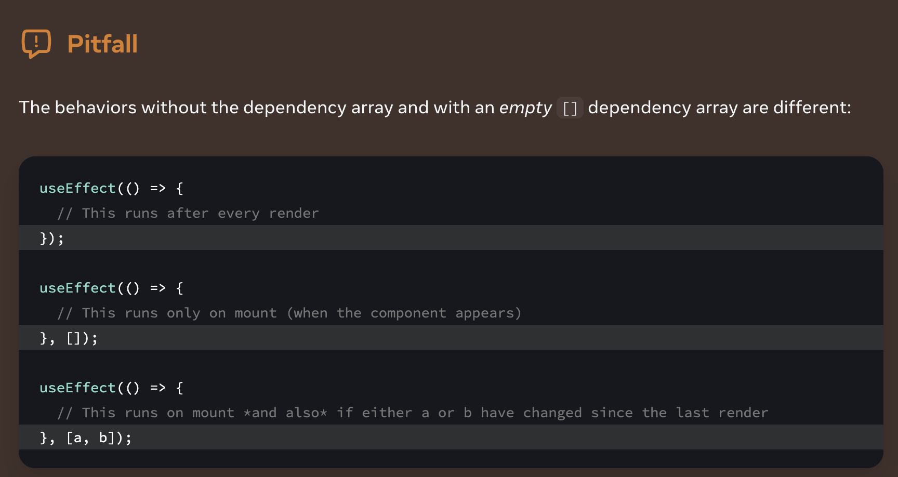
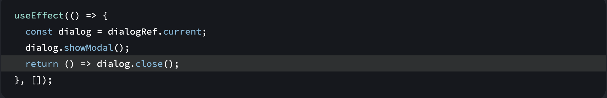
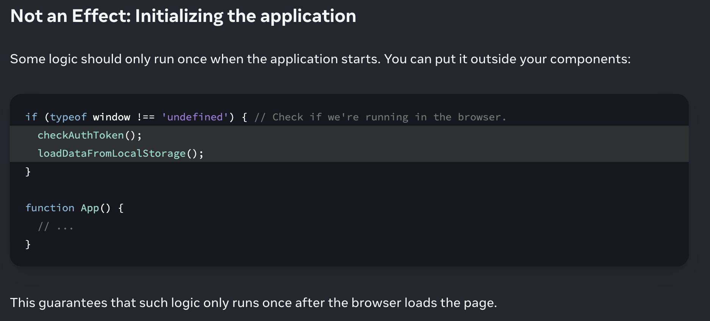

Sometimes Rendering code , event handlers isn’t enough. Consider a ChatRoom component that must connect to the chat server whenever it’s visible on the screen. Connecting to a server is not a pure calculation (it’s a side effect) so it can’t happen during rendering. However, there is no single particular event like a click that causes ChatRoom to be displayed.

Effects let you specify side effects that are caused by rendering itself, rather than by a particular event

useEffect “delays” a piece of code from running until that render is reflected on the screen.

Pitfall :

By default, Effects run after every render. This is why code like this will produce an infinite loop:

const [count, setCount] = useState(0);
useEffect(() => {
setCount(count + 1);
});

Effects should usually synchronize your components with an external system. If there’s no external system and you only want to adjust some state based on other state, you might not need an Effect.

The dependency array can contain multiple dependencies. React will only skip re-running the Effect if all of the dependencies you specify have exactly the same values as they had during the previous render.

Step 3: Add cleanup if needed 

Controlling non-React widgets 
Triggering animations - rreset to default
User events - Listening to , Unsubscribe to 
Sending analytics
Fetching data 
Initialing app 

Some APIs may not allow you to call them twice in a row. For example, the showModal method of the built-in <dialog> element throws if you call it twice. Implement the cleanup function and make it close the dialog:

You Might Not Need an Effect

You don’t need Effects to transform data for rendering.

Ex:
Updating state based on props or state 
Caching expensive calculations - 
    useMemo(()=>{},[one , two]) //  ✅ Does not re-run getFilteredTodos() unless todos or filter change

    console.time('filter array');
    console.timeEnd('filter array');

    Keep in mind that your machine is probably faster than your users’ so it’s a good idea to test the performance with an artificial slowdown. For example, Chrome offers a CPU Throttling option for this.

Resetting all state when a prop changes 
  key prop 

 

You don’t need Effects to handle user events

