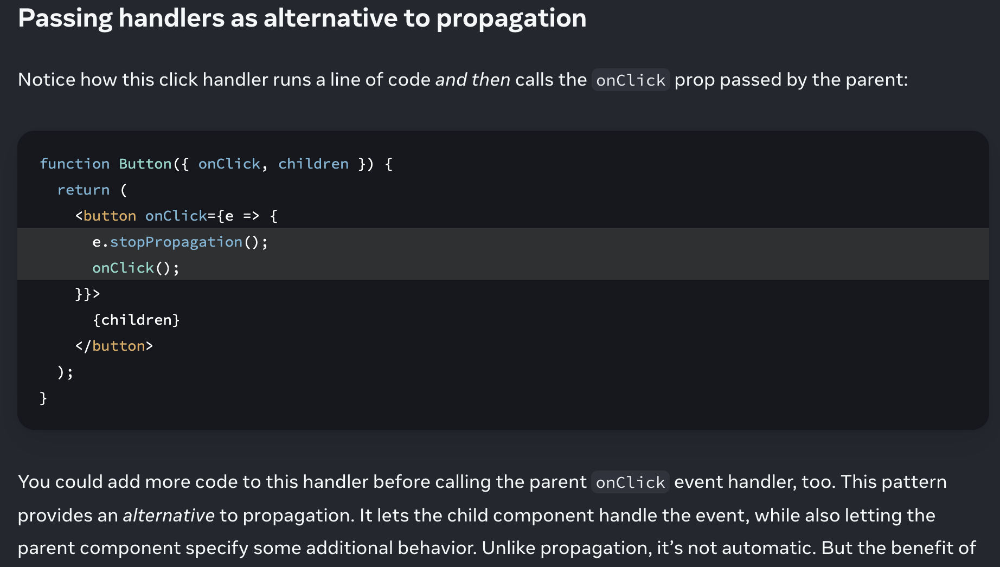

Event propagation 
Event handlers will also catch events from any children your component might have. We say that an event “bubbles” or “propagates” up the tree: it starts with where the event happened, and then goes up the tree.

Stopping propagation 
Event handlers receive an event object as their only argument. By convention, it’s usually called e, which stands for “event”. You can use this object to read information about the event.

That event object also lets you stop the propagation. If you want to prevent an event from reaching parent components, you need to call e.stopPropagation()

e.stopPropagation() stops the event handlers attached to the tags above from firing.
e.preventDefault() prevents the default browser behavior for the few events that have it.

STATE A COMPONENTS MEMORY
Components often need to change what’s on the screen as a result of an interaction. 
if we use a normal local variable 

The handleClick event handler is updating a local variable, index. But two things prevent that change from being visible:

    Local variables don’t persist between renders. When React renders this component a second time, it renders it from scratch—it doesn’t consider any changes to the local variables.

    Changes to local variables won’t trigger renders. React doesn’t realize it needs to render the component again with the new data.
    To update a component with new data, two things need to happen:

1.Retain the data between renders.
2.Trigger React to render the component with new data (re-rendering).

The useState Hook provides those two things:

A state variable to retain the data between renders.
A state setter function to update the variable and trigger React to render the component again.

array destructuring:

The [ and ] syntax here is called array destructuring and it lets you read values from an array. The array returned by useState always has exactly two items.

Hooks—
are special functions that are only available while React is rendering . They let you “hook into” different React features.

functions starting with use—

    can only be called at the top level of your components or your own Hooks. 

    You can’t call Hooks inside conditions, loops, or other nested functions.

    Hooks are functions, but it’s helpful to think of them as unconditional declarations about your component’s needs.
    
    You “use” React features at the top of your component similar to how you “import” modules at the top of your file.

Your component renders the first time.

const [index, setIndex] = useState(0);

1st render - useState returns - [0, setIndex]. 
update index 
2nd render - useState returns - [1, setIndex]. 
so on ...

<h2>State is isolated and private</h2>

Challenge 3 of 4: Fix a crash 
Here is a small form that is supposed to let the user leave some feedback. When the feedback is submitted, it’s supposed to display a thank-you message. However, it crashes with an error message saying “Rendered fewer hooks than expected”. Can you spot the mistake and fix it?

