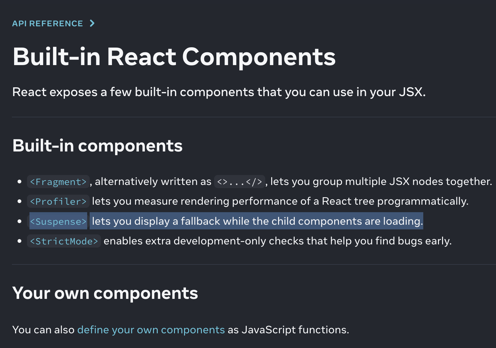

<Suspense> lets you display a fallback while the child components are loading.



<Suspense>
<Suspense> lets you display a fallback until its children have finished loading.


```
<Suspense fallback={<Loading />}>
  <SomeComponent />
</Suspense>
```


#### Built-in React Components
React exposes a few built-in components that you can use in your JSX.

Built-in components 
<Fragment>, alternatively written as <>...</>, lets you group multiple JSX nodes together.
<Profiler> lets you measure rendering performance of a React tree programmatically.
<Suspense> lets you display a fallback while the child components are loading.
<StrictMode> enables extra development-only checks that help you find bugs early.

your own components 