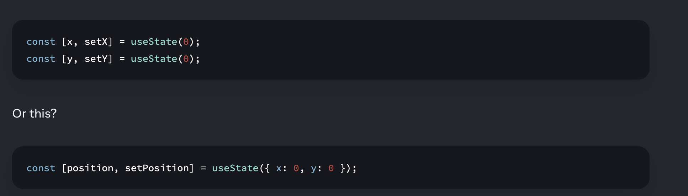
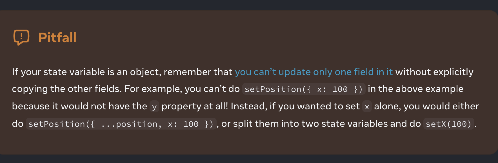
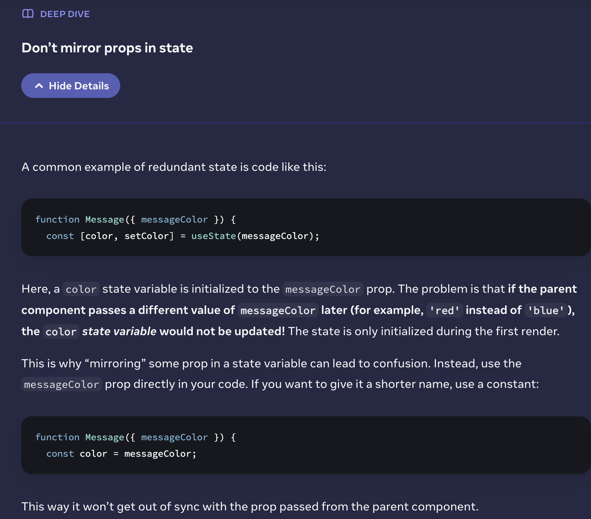

# Cornel

### Date: November 5, 2019

### Topic: Sharing State btw component s

### Recall

what to do when u want props to cordinate

form event

### Notes

- When you want to coordinate two components, move their state to their common parent.
  -Then pass the information down through props from their common parent.
  -Finally, pass the event handlers down so that the children can change the parent’s state.
  -It’s useful to consider components as “controlled” (driven by props) or “uncontrolled” (driven by state).

- (e.target.value);

<aside>
📌 **SUMMARY:**
 
</aside>

---

### Date: November 5, 2019

### Topic:

### Recall

### Notes

- ...
- ...

<aside>
📌 **SUMMARY:**

</aside>

---

### Date: November 5, 2019

### Topic:

### Recall

### Notes

- ...
- ...

<aside>
📌 **SUMMARY:**

</aside>

---

### Date: November 5, 2019

### Topic:Choosing the State Structure

### Recall

Principles of choosing state -5

dont mirror props
obj as state

### Notes

- Group related state.
  -- If you always update two or more state variables at the same time, consider merging them into a single state variable.
  -Avoid contradictions in state.
  --When the state is structured in a way that several pieces of state may contradict and “disagree” with each other, you leave room for mistakes. Try to avoid this.
  -Avoid redundant state.
  --If you can calculate some information from the component’s props or its existing state variables during rendering, you should not put that information into that component’s state.
  -Avoid duplication in state.
  --When the same data is duplicated between multiple state variables, or within nested objects, it is difficult to keep them in sync. Reduce duplication when you can.
  -Avoid deeply nested state.
  --Deeply hierarchical state is not very convenient to update. When possible, prefer to structure state in a flat way.
- ...
  
  
  

if updating deeply nested state is complicated, try flattening it.

<aside>
📌 **SUMMARY:**

</aside>

---

### Date: November 5, 2019

### Topic:

### Recall

### Notes

- ...
- ...

<aside>
📌 **SUMMARY:**

</aside>

---

### Date: March 6, 2023

### Topic: .

### Recall

### Notes

- ...
- ...
